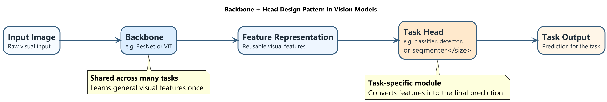
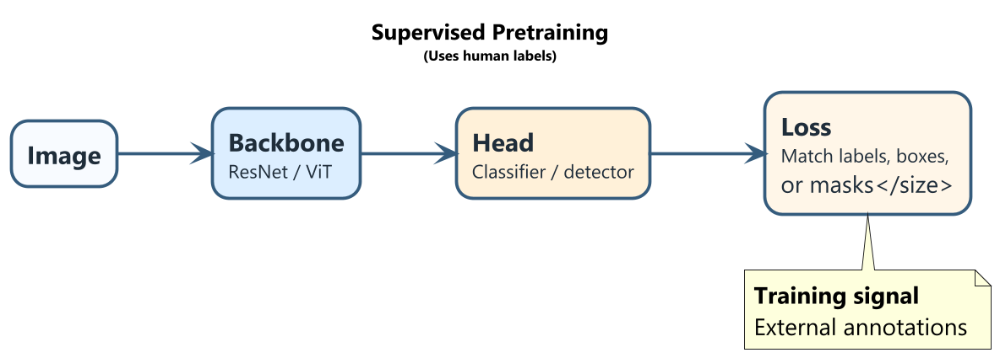
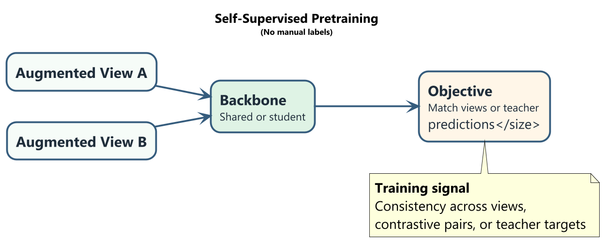
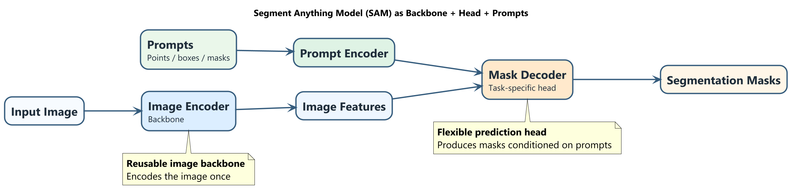
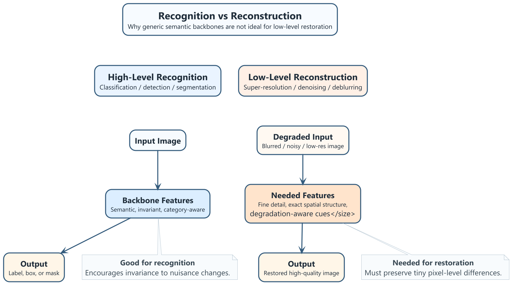

# Modern Computer Vision Architecture: Backbones, Heads and Pretraining

## 1. Introduction

Modern vision models are typically modular: a **backbone** extracts reusable visual features, and a **head** maps those features to a task output. Early backbone layers capture local patterns (edges/textures); deeper layers capture semantic structure. The same backbone can therefore support multiple downstream tasks by replacing or fine-tuning the head.

This separation improves transfer learning efficiency: instead of retraining full models for each task, we reuse one pretrained representation and attach task-specific heads.

- **Backbone (in simple terms):** the main feature extractor shared across tasks.
- **Head (in simple terms):** the task-specific predictor attached to backbone features (classifier, detector, segmenter, depth regressor, etc.).

### Example 1: ResNet reuse across tasks

ResNet was introduced for ImageNet classification [1], then reused in detection and segmentation pipelines such as Faster R-CNN and Mask R-CNN [2,3]. The backbone remains similar; the head changes with task requirements.

### Example 2: ViT/DINO-style backbone reuse

ViT backbones are used for classification, detection, segmentation, and depth tasks [4]. DINO-style self-supervised ViTs are similarly adapted with different heads for downstream tasks [5].

Figure 1 shows the core pattern: reusable feature extraction in the backbone and task adaptation in the head.

## 2. Supervised vs Self-Supervised Pretraining

Pretraining initializes a backbone before task-specific adaptation. The key difference is the supervision source.

### 2.1 Supervised pretraining

In supervised pretraining, learning is guided by human annotations.

- **ImageNet classification pretraining** (e.g., VGG/ResNet) learns category-discriminative features from class labels [1,6].
- **Detection pretraining** (e.g., COCO in Faster/Mask R-CNN) adds localization signals (boxes/masks), encouraging spatially aware object features [2,3].

For each strategy:

- **ImageNet classification pretraining**
  - Training signal: image-level class labels.
  - Features encouraged: category-level semantic discrimination and invariance to nuisance factors.
- **COCO detection pretraining**
  - Training signal: object classes + bounding boxes (and masks for Mask R-CNN).
  - Features encouraged: object-level, spatially localized representations useful for recognition + localization.

Supervised pretraining is strongly aligned with labeled objectives but depends on annotation quality and coverage.

### 2.2 Self-supervised pretraining

Self-supervised learning (SSL) derives supervision from data structure rather than manual labels.

- **Contrastive/Siamese methods** (SimCLR, MoCo) match augmented views of the same image while separating different images [7,8].
- **DINO-style self-distillation** aligns student and teacher predictions across views; teacher weights are EMA-updated from the student [5].

For each strategy:

- **Contrastive/Siamese (e.g., SimCLR, MoCo)**
  - Training signal: positive pairs (two views of same image) are pulled together; negatives (different images) are pushed apart.
  - Features encouraged: invariance to augmentations and grouping by semantic similarity.
- **DINO self-distillation**
  - Training signal: student matches teacher outputs for different views without labels.
  - Features encouraged: robust view-invariant features and emergent object-aware structure.

SSL can scale to large unlabeled corpora and often yields transferable representations.

### 2.3 Practical comparison

- **Key difference in supervision source**
  - Supervised: external human labels.
  - SSL: intrinsic data relationships (matching/contrasting views or student-teacher consistency).
- **Key difference in representation style**
  - Supervised: often more label-space aligned.
  - SSL: often broader and less taxonomy-bound, with strong transfer potential.
- **One SSL advantage:** scales with abundant unlabeled data and lowers annotation dependence.
- **One SSL limitation:** pretraining objective may be imperfectly aligned with downstream tasks, requiring stronger adaptation/fine-tuning.

## 3. Case Study: SAM as Backbone + Head

Segment Anything Model (SAM) is a clear backbone-head system [9]:

- **Image encoder** acts as a reusable backbone.
- **Prompt encoder** converts points/boxes/masks into conditioning signals.
- **Mask decoder** is the task head that predicts masks conditioned on prompts.

Role of prompts:

- Point/box/mask prompts specify *what to segment* in the same image representation space.
- By changing prompts (and usage mode), SAM can perform different segmentation-like behaviors without retraining the full backbone.

Conceptual takeaway: SAM demonstrates the principle “train a strong backbone once, then reuse it across many segmentation-like tasks via prompt-conditioned heads/decoding.”

## 4. Limitations of Generic Backbones

Generic recognition backbones are not universally optimal. A representative limitation is **image super-resolution**.

Super-resolution requires precise pixel-level reconstruction (textures, edges, local correspondences). Recognition-oriented backbones are often trained for semantic invariance, which can suppress the fine detail required for restoration.

Why high-level invariant features may be insufficient:

- The task is not only “what is in the image,” but “what exact pixel detail is missing.”
- Invariance helpful for recognition can remove information needed for faithful reconstruction.

What is needed instead:

- fine-grained pixel-level structure and local correspondence,
- inductive bias for restoration/degradation inversion,
- task-specific objectives for perceptual and reconstruction fidelity.

Hence, super-resolution and similar low-level tasks (denoising, deblurring, raw processing, optical flow) typically need specialized architectures and losses designed for local fidelity and reconstruction constraints, not only semantic abstraction.

## Conclusion

The backbone-head paradigm is central to modern vision: backbones provide transferable representations, and heads provide task specialization. Both supervised and self-supervised pretraining fit this paradigm, with different strengths in label dependence, scalability, and objective alignment.

SAM demonstrates the practical power of this design by combining a shared backbone with prompt-conditioned decoding. However, the same modular strategy has limits: low-level reconstruction tasks often require task-specific inductive biases beyond generic semantic backbones.

## References

[1] K. He, X. Zhang, S. Ren, and J. Sun, "Deep Residual Learning for Image Recognition," 2016.

[2] S. Ren, K. He, R. Girshick, and J. Sun, "Faster R-CNN: Towards Real-Time Object Detection with Region Proposal Networks," 2015.

[3] K. He, G. Gkioxari, P. Dollar, and R. Girshick, "Mask R-CNN," 2017.

[4] A. Dosovitskiy et al., "An Image is Worth 16x16 Words: Transformers for Image Recognition at Scale," 2021.

[5] M. Caron et al., "Emerging Properties in Self-Supervised Vision Transformers," 2021.

[6] K. Simonyan and A. Zisserman, "Very Deep Convolutional Networks for Large-Scale Image Recognition," 2015.

[7] T. Chen et al., "A Simple Framework for Contrastive Learning of Visual Representations," 2020.

[8] K. He, H. Fan, Y. Wu, S. Xie, and R. Girshick, "Momentum Contrast for Unsupervised Visual Representation Learning," 2020.

[9] A. Kirillov et al., "Segment Anything," 2023.
