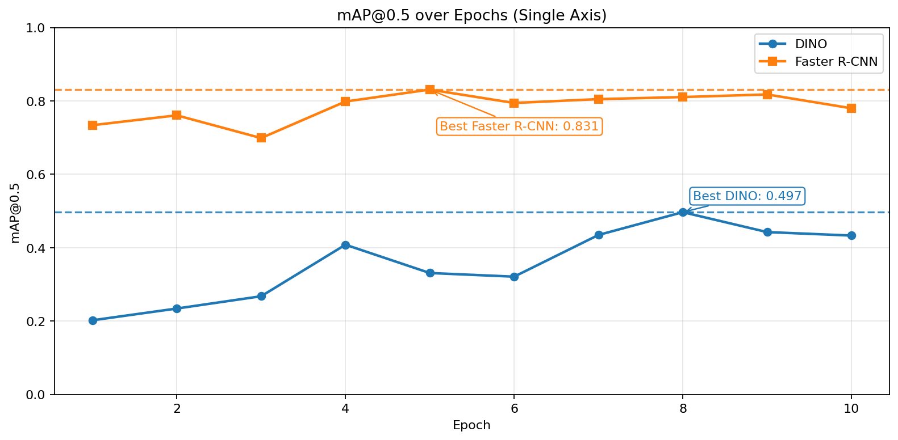
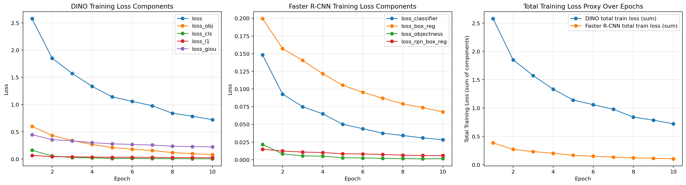
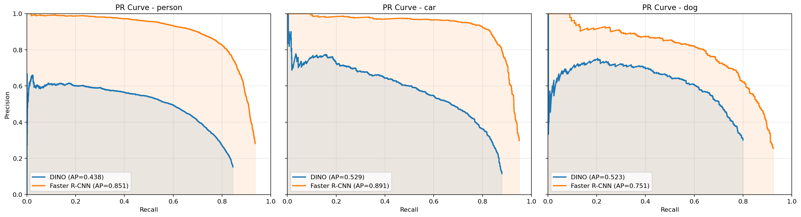
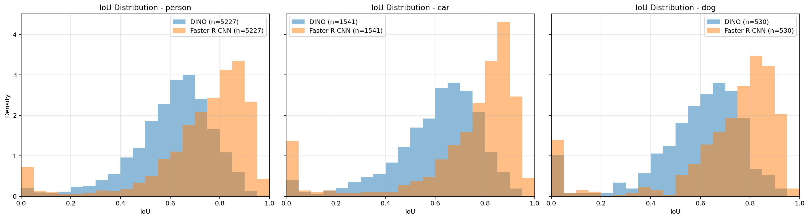

# Assignment 2: Object Detection with a Pretrained Backbone (DINO + Head)

## 1. Task and Dataset

This project implements object detection on **PASCAL VOC 2007** with the class subset **{person, car, dog}**.  
The official `trainval` split is used for training and the official `test` split is used for evaluation.

### 1.1 Data Configuration Used

- Train root: `data/train-validation-data`
- Test root: `data/test-data`
- Classes: `person`, `car`, `dog`
- Train subset size: **1000** images (seed `42`)
- Test size after class filtering: **2895** images
- Batch size: **4**
- Epochs: **10**
- Image size: **448 x 448**
- Workers: **0**

### 1.2 Reproducibility Check

The audit trail records filtered image IDs and SHA-256 signatures:

- Train subset SHA-256: `28a4ca86db9f501eb0cee8f9403461776aab6e8d6200391b707564073273017e`
- Test subset SHA-256: `71b8e73e8ebdf89bc5044cae094c6d6f69fa7564706ac39f3f76feafea5ce6f2`

This confirms the same train/test data protocol across compared models.

## 2. Model Designs

### 2.1 Main Model: Frozen DINOv2 + Custom Grid Head

The main detector uses **`facebook/dinov2-small`** as a frozen feature backbone and trains only a custom detection head.

Pipeline summary:

1. Resize input to `448x448`
2. Normalize and pass image through DINOv2 backbone
3. Extract patch tokens from `last_hidden_state` (discard class token)
4. Reshape tokens into a 2D feature map
5. Apply custom grid head for objectness, class logits, and box regression

Head/loss design:

- Projection block followed by separate classification and box towers
- Objectness head + class head + box head
- Objectness branch (BCE with balancing)
- Classification branch (cross-entropy on positive cells)
- Box regression with L1 + GIoU
- Box decoding in grid-relative center format

Train/freeze policy:

- **Frozen parameters:** all DINOv2 backbone parameters (`requires_grad=False`)
- **Trainable parameters:** custom detection head parameters only

Trainable parameters: **3,644,680**

### 2.2 Comparison Model: Faster R-CNN (ResNet-50 FPN)

Comparison strategy is **Faster R-CNN with ResNet-50 FPN** (`torchvision`) fine-tuned on the same subset and classes.

Backbone/model and fine-tuning setup:

- Backbone/model: `fasterrcnn_resnet50_fpn` with pretrained `FasterRCNN_ResNet50_FPN_Weights.DEFAULT`
- Detector head adaptation: ROI predictor replaced (`FastRCNNPredictor`) for the assignment class setup
- Fine-tuning in this project: full-model fine-tuning by default (backbone trainable), with optional backbone freezing flag available in code

Trainable parameters: **41,087,011**

## 3. Experiments and Results

### 3.1 Quantitative Comparison

| Model / Strategy                          | Trainable Params | Train Images | Test Images | Best Epoch | Best mAP@0.5 |
|-------------------------------------------|-----------------:|-------------:|------------:|-----------:|-------------:|
| DINO Backbone (Frozen) + Custom Grid Head |        3,644,680 |         1000 |        2895 |          8 |       0.4967 |
| Faster R-CNN ResNet-50 FPN                |       41,087,011 |         1000 |        2895 |          5 |       0.8309 |

Best per-class AP at best epoch:

- **DINO**: person `0.4384`, car `0.5287`, dog `0.5229`
- **Faster R-CNN**: person `0.8511`, car `0.8907`, dog `0.7508`

### 3.2 Learning Curves and Stability

**Figure 1 summary:** Faster R-CNN maintains a higher mAP trajectory; DINO improves steadily and peaks at epoch 8.

**Figure 2 summary:** DINO reaches its strongest relative performance on `car` and `dog`, while Faster R-CNN remains dominant on all classes.

**Figure 3 summary:** both models show stable optimization; DINO losses decrease substantially after early epochs.

### 3.3 AP/PR and IoU Diagnostics

**Figure 4 summary:** PR envelopes for Faster R-CNN are consistently above DINO, matching the mAP results.

**Figure 5 summary:** IoU distributions confirm stronger localization quality for Faster R-CNN; DINO remains usable but less precise.

### 3.4 Qualitative Comparison

**Figure 6 summary:** visual inspection shows DINO can detect target classes but with more misses and box inaccuracies than Faster R-CNN.

## 4. Discussion

### 4.1 Under Limited Compute and Limited Labels

Under the current constraints (1000 training images, fixed test split, modest training budget), the preferred strategy is **Faster R-CNN (comparison model)** rather than frozen DINO + small head.  
Although the DINO approach is more parameter-efficient, model predictions show that Faster R-CNN is consistently stronger on both classification and localization quality (higher AP/mAP, fewer missed detections, tighter boxes on difficult samples).  
In this setting, the performance gain from a supervised detection architecture outweighs the compute savings of a frozen-backbone adaptation.

### 4.2 If More Data/Compute Were Available

With more labeled data and larger compute budget, strategy choice becomes more balanced.  
Faster R-CNN would remain a strong baseline, but the DINO path would become more attractive if we:

- partially unfreeze later DINO blocks,
- increase detection-head capacity and multi-scale modeling,
- train longer with larger subsets or full trainval data.

These changes should improve adaptation of self-supervised features to detection, and can reduce the current accuracy gap while keeping transfer/reuse advantages.

### 4.3 Link to Assignment 1 Themes

- **Backbones vs heads:** observed results reinforce that backbone quality alone is not sufficient; the detection head design and loss formulation strongly determine end-task performance.
- **Supervised vs self-supervised pretraining:** DINO (self-supervised) transfers meaningfully, but supervised detection pretraining (Faster R-CNN stack) is more effective in this low-data detection setup.
- **Reusing one backbone across tasks:** frozen DINO remains strategically useful because one pretrained representation can be reused across tasks with lightweight task-specific heads, even when accuracy is lower than specialized supervised detectors.

## 5. Conclusion

This project satisfies the assignment requirements by comparing:

1. **Frozen DINOv2-small + custom detection head**
2. **Faster R-CNN (ResNet-50 FPN) fine-tuned baseline**

Using the same training subset (1000 images; classes: person/car/dog) and the same VOC2007 test protocol, Faster R-CNN clearly outperformed the frozen DINO-head model on both detection accuracy and localization quality. Best test performance was:

- **DINO + head:** mAP@0.5 = **0.4967**
- **Faster R-CNN:** mAP@0.5 = **0.8309**

The key practical finding is that, under limited labeled data and limited compute, a supervised detection architecture remains the stronger choice for final accuracy. However, the DINO approach still demonstrates meaningful transfer with far fewer trainable parameters, making it a viable parameter-efficient strategy and a strong foundation for future improvement (e.g., partial unfreezing and stronger multi-scale heads when more compute/data are available).
