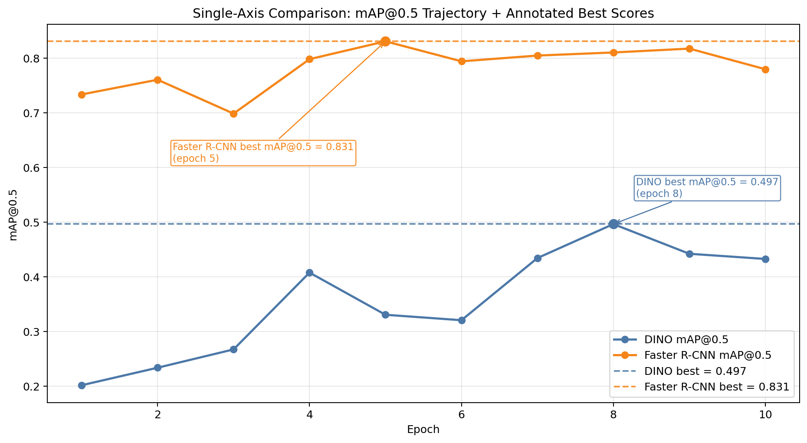
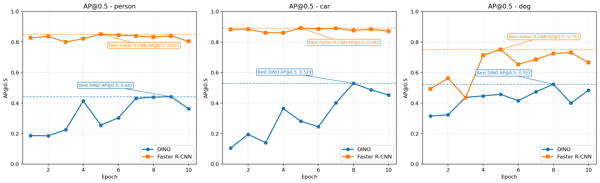
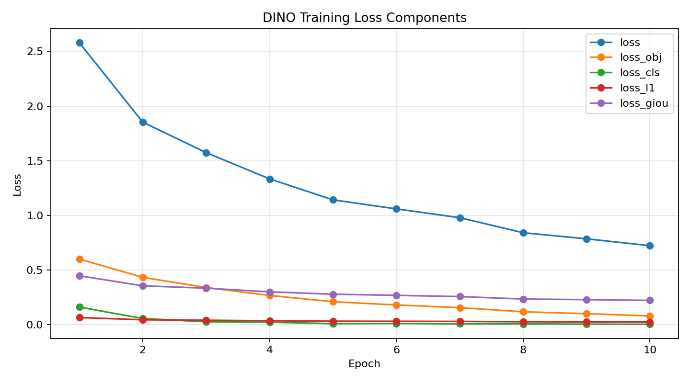
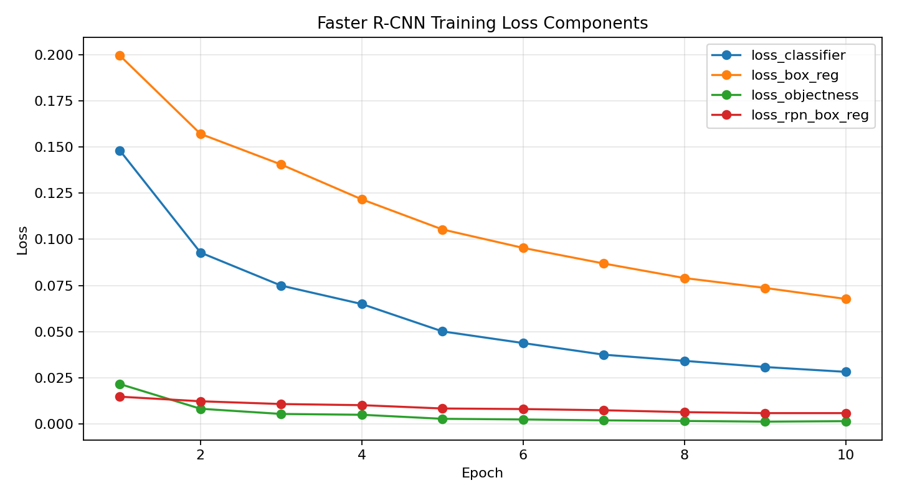
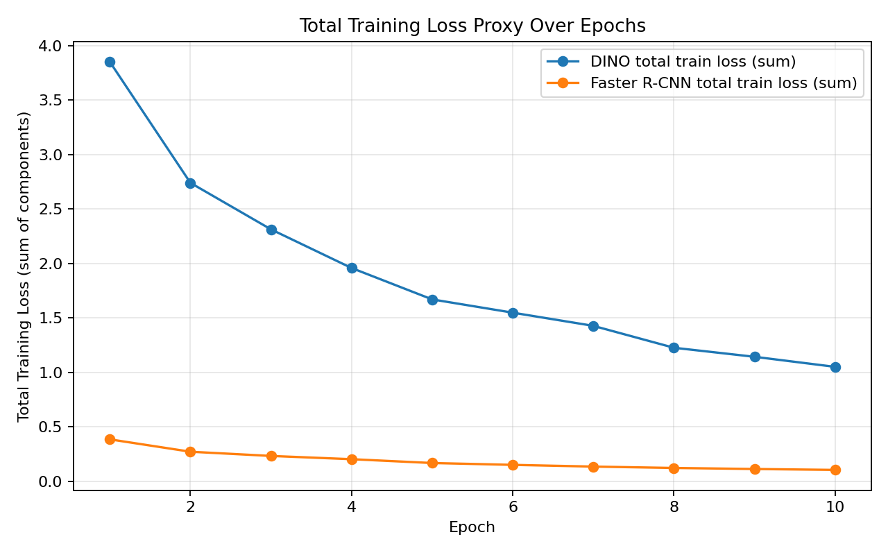
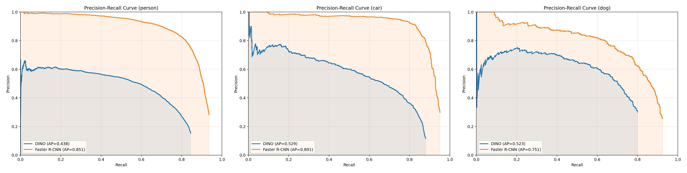
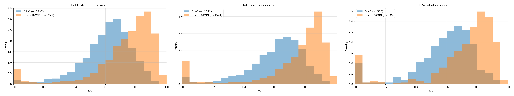
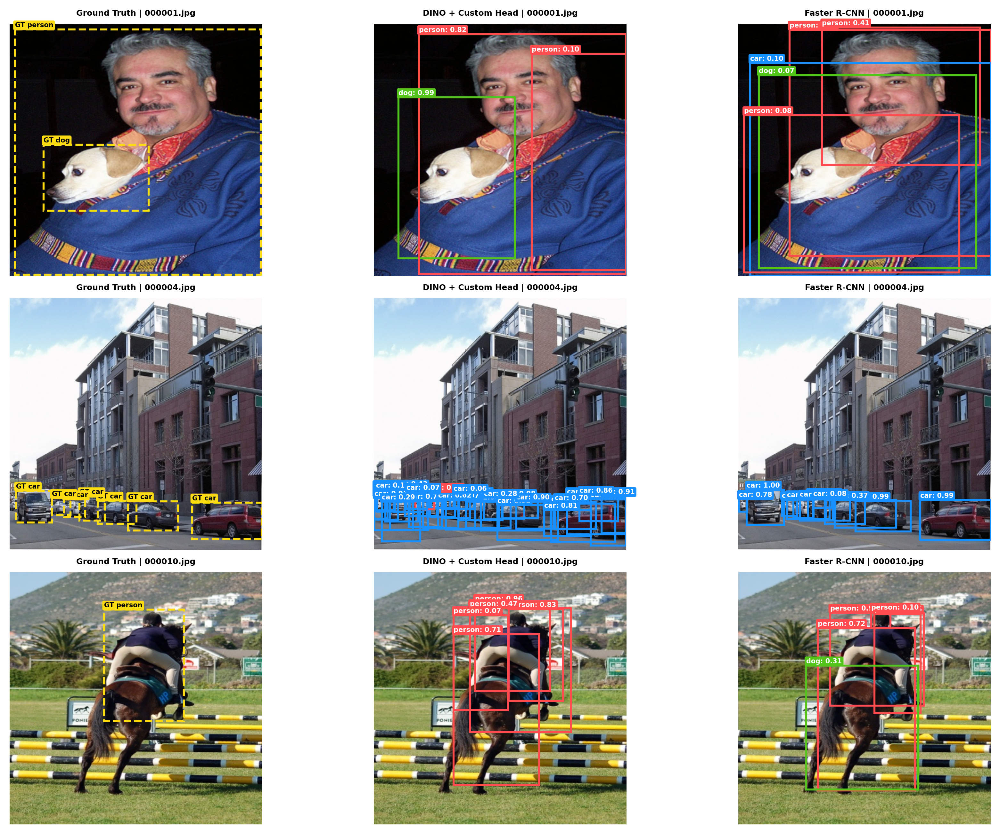

# Assignment 2: Object Detection with a Pretrained Backbone

## 1. Task and Data

This project studies object detection on **PASCAL VOC 2007** using the restricted class subset **{person, car, dog}**. The official **trainval** split is used for training and the official **test** split is used for evaluation. Both splits are filtered so that only images containing at least one of the three target classes are retained.

The dataset roots used in the implementation are:

- Training root: `data/train-validation-data`
- Test root: `data/test-data`

Both the DINO-based detector and the Faster R-CNN baseline were trained and evaluated on the same filtered data configuration:

- Classes: `person`, `car`, `dog`
- Training images used: **1000**
- Test images used: **2895**
- Subsampling: reproducible random subset with seed `42`
- Batch size: **4**
- Epochs: **10**

Current project defaults (menu and CLI):

- Image size: **320 x 320**
- Data-loader workers: **2**
- Learning rate: **1e-4**
- Weight decay: **1e-4**

Archived final result runs used in this report (`outputs/dino-final`, `outputs/fasterrcnn-final`) were executed with:

- Image size: **448 x 448**
- Data-loader workers: **0**

The audit manifests confirm the exact subset identity:

- Train subset SHA-256: `28a4ca86db9f501eb0cee8f9403461776aab6e8d6200391b707564073273017e`
- Test subset SHA-256: `71b8e73e8ebdf89bc5044cae094c6d6f69fa7564706ac39f3f76feafea5ce6f2`

This matters because the assignment requires the same train subset and the same test split across all compared models.

## 2. Current Project Structure and Execution

The current implementation is organized around an interactive menu and modular scripts:

- `main.py` launches `src.ui.MenuApp`
- `src/train.py` handles model training
- `src/evaluate.py` handles evaluation runs
- `src/visualise.py` renders prediction comparisons
- `src/ap_plots.py` generates AP/PR plots only
- `src/iou_plots.py` generates IoU-focused plots (separate workflow)

Menu options currently exposed:

1. View Reports  
2. Visualise Test  
3. Evaluate Training  
4. Train Models

## 3. Model Designs

### 3.1 Main Model: Frozen DINOv2 + Custom Detection Head

The main model uses **DINOv2-small** (`facebook/dinov2-small`) as a frozen pretrained backbone. The model is loaded through Hugging Face `transformers`, and the backbone weights are frozen so that only the custom detection head is trained.

Feature extraction works as follows:

- Input images are resized to `448 x 448`
- DINOv2 patch tokens are extracted
- The class token is discarded
- The remaining patch tokens are reshaped into a 2D spatial feature map

On top of this feature map, the project implements a custom **grid-based detection head**:

- a projection layer adapts DINO features to the detector head width
- an objectness branch predicts whether a grid location contains an object
- a classification branch predicts one of the three classes `{person, dog, car}`
- a regression branch predicts bounding boxes in normalized `(cx, cy, w, h)` form

The final version of the head includes:

- objectness-balanced BCE loss
- class cross-entropy loss on positive cells
- L1 and generalized IoU box losses
- grid-relative center decoding during training and inference

Training strategy:

- Backbone frozen: **yes**
- Trainable parameters: **3,644,680**
- Model role: lightweight detector head on reusable self-supervised features

### 3.2 Comparison Model: Faster R-CNN with ResNet-50 FPN

The comparison strategy is **Faster R-CNN + ResNet-50 FPN** from `torchvision`. This is a supervised detection baseline that fine-tunes a detection-specific architecture rather than attaching a lightweight head to a frozen backbone.

Training strategy:

- Backbone/model: Faster R-CNN with ResNet-50 FPN
- Fine-tuning: detector and backbone train together
- Trainable parameters: **41,087,011**

This gives a much stronger but much heavier baseline than the frozen DINO approach.

## 4. Experiments and Results

### 4.1 Experimental Setup

Shared settings across both models:

- Dataset: VOC2007 filtered to `person`, `car`, `dog`
- Train split: official `trainval`
- Test split: official `test`
- Training subset size: `1000`
- Batch size: `4`
- Epochs: `10`
- Seed: `42`
- Metric: **mAP@0.5**
- Recorded runs: CPU-based

The key practical fixes were:

- using `448 x 448` consistently for training, evaluation, and visualization
- forcing `--workers 0` because multiprocessing workers failed in this environment
- using local cache directories for Torch/Matplotlib
- loading DINO through the cached Hugging Face backbone instead of relying on live network access

### 4.2 Quantitative Results

| Model / Strategy                          | Trainable Params | Train Images | Test Images | Best Epoch | Best mAP@0.5 |
|-------------------------------------------|-----------------:|-------------:|------------:|-----------:|-------------:|
| DINO Backbone (Frozen) + Custom Grid Head |        3,644,680 |         1000 |        2895 |          8 |       0.4967 |
| Faster R-CNN ResNet-50 FPN                |       41,087,011 |         1000 |        2895 |          5 |       0.8309 |

Final DINO best per-class AP at the best epoch:

- `person`: **0.4384**
- `car`: **0.5287**
- `dog`: **0.5229**

Faster R-CNN best per-class AP at the best epoch:

- `person`: **0.8511**
- `car`: **0.8907**
- `dog`: **0.7508**

Training and mAP trends:

AP/PR diagnostics from the current plotting pipeline:

Interpretation:

- The frozen DINO + custom head model now clearly learns meaningful detections and no longer collapses to zero.
- Faster R-CNN remains substantially stronger overall, which is expected from a detection-specialized supervised baseline with many more trainable parameters.
- The final DINO result is still useful academically because it demonstrates that a frozen self-supervised backbone can support object detection with a relatively small task head under constrained compute.

### 4.3 IoU Diagnostics

IoU diagnostics were generated as a separate analysis track:

These are useful for error analysis, but the assignment comparison metric remains AP/mAP.

### 4.4 Qualitative Results

The visualization pipeline exports comparison panels into `outputs/viz/...` with:

- ground-truth boxes
- DINO predictions
- Faster R-CNN predictions

## 5. Discussion

### 5.1 Under Limited Compute and Limited Labeled Data

Under limited compute, the frozen DINO approach is attractive because it trains far fewer parameters than Faster R-CNN and reuses a strong self-supervised representation. This makes it conceptually elegant and practical when GPU resources are limited.

In practice, the results show that the detector head design matters a lot. The first DINO attempt failed completely, but after fixing the detection head and training path, the model reached **0.4967 mAP@0.5**. That is a substantial improvement over the earlier zero-result behavior, but it still trails the Faster R-CNN baseline by a large margin.

So under the exact constraints of this assignment, the comparison strategy is stronger for raw performance, while frozen DINO + custom head is stronger as a demonstration of backbone reuse and parameter-efficient adaptation.

### 5.2 If More Data and More Compute Were Available

With more data and more compute, I would move beyond the fully frozen setup and test:

- partial unfreezing of later DINO blocks
- a stronger multi-scale detection head
- longer training and possibly larger train subsets

That would likely narrow the gap with Faster R-CNN. The current result suggests that the DINO representation is useful, but the simple frozen setup leaves performance on the table.

### 5.3 Connection to Assignment 1 Themes

**Backbones vs heads**

This project makes the backbone/head distinction explicit. DINOv2 acts as a reusable visual backbone, while the custom grid detector head performs the task-specific conversion from features to boxes and class scores.

**Supervised vs self-supervised pretraining**

DINOv2 is self-supervised, whereas Faster R-CNN depends on a supervised detection-oriented backbone and architecture. The final results suggest that general visual features are helpful, but detection performance still depends heavily on the downstream task head and training design.

**Reusing a single backbone for many tasks**

The DINO-based detector is a direct example of representation reuse: a single pretrained encoder can be adapted to a new task using a comparatively small custom head. Even though Faster R-CNN wins on absolute score, the DINO experiment still demonstrates the flexibility of transferable pretrained backbones.

## 6. Conclusion

The project satisfies the assignment requirements with two compared strategies:

1. **Frozen DINOv2-small backbone + custom detection head**
2. **Faster R-CNN ResNet-50 FPN baseline**

Both runs use the same `1000`-image train subset, the same `2895`-image filtered VOC2007 test split, and the same target classes.

The final DINO run achieved a best result of **0.4967 mAP@0.5**, proving that the fixed DINO pipeline does learn useful detections. The Faster R-CNN baseline remained stronger at **0.8309 mAP@0.5** at epoch 5, and the final qualitative comparison figures were generated successfully.

The main strategic lesson is that a strong pretrained backbone is valuable, but object detection accuracy still depends heavily on the quality of the downstream head and the overall detection architecture. A frozen self-supervised backbone can work, but a specialized supervised detector remains more effective when the goal is maximum detection performance.
