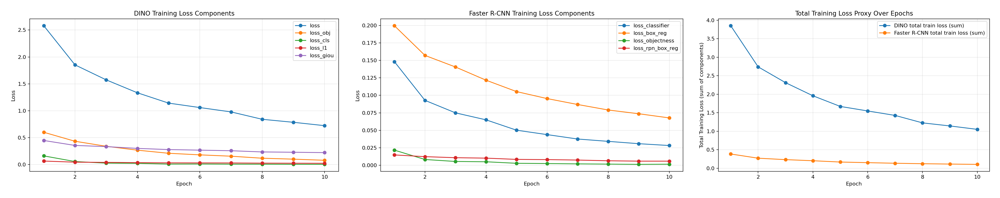

# Assignment 2: Object Detection with a Pretrained Backbone (DINO + Head)

## 1. Task and Dataset

This project implements object detection on **PASCAL VOC 2007** with the class subset **{person, car, dog}**.  
The official `trainval` split is used for training and the official `test` split is used for evaluation.

### 1.1 Data Configuration Used

- Train root: `data/train-validation-data`
- Test root: `data/test-data`
- Classes: `person`, `car`, `dog`
- Train subset size: **1000** images (seed `42`)
- Test size after class filtering: **2895** images
- Batch size: **4**
- Epochs: **10**
- Image size: **448 x 448**
- Workers: **0**

### 1.2 Reproducibility Check

The audit trail records filtered image IDs and SHA-256 signatures:

- Train subset SHA-256: `28a4ca86db9f501eb0cee8f9403461776aab6e8d6200391b707564073273017e`
- Test subset SHA-256: `71b8e73e8ebdf89bc5044cae094c6d6f69fa7564706ac39f3f76feafea5ce6f2`

This confirms the same train/test data protocol across compared models.

## 2. Model Designs

### 2.1 Main Model: Frozen DINOv2 + Custom Grid Head

The main detector uses **`facebook/dinov2-small`** as a frozen feature backbone and trains only a custom detection head.

Pipeline summary:

1. Resize input to `448x448`
2. Extract DINO patch tokens (discard class token)
3. Reshape tokens into a 2D feature map
4. Apply custom grid head for objectness, class logits, and box regression

Head/loss design:

- Objectness branch (BCE with balancing)
- Classification branch (cross-entropy on positives)
- Box regression with L1 + GIoU
- Box decoding in grid-relative center format

Trainable parameters: **3,644,680**

### 2.2 Comparison Model: Faster R-CNN (ResNet-50 FPN)

Comparison strategy is **Faster R-CNN with ResNet-50 FPN** (`torchvision`) fine-tuned on the same subset and classes.

Trainable parameters: **41,087,011**

## 3. Experiments and Results

### 3.1 Quantitative Comparison

| Model / Strategy                          | Trainable Params | Train Images | Test Images | Best Epoch | Best mAP@0.5 |
|-------------------------------------------|-----------------:|-------------:|------------:|-----------:|-------------:|
| DINO Backbone (Frozen) + Custom Grid Head |        3,644,680 |         1000 |        2895 |          8 |       0.4967 |
| Faster R-CNN ResNet-50 FPN                |       41,087,011 |         1000 |        2895 |          5 |       0.8309 |

Best per-class AP at best epoch:

- **DINO**: person `0.4384`, car `0.5287`, dog `0.5229`
- **Faster R-CNN**: person `0.8511`, car `0.8907`, dog `0.7508`

### 3.2 Learning Curves and Stability

**Figure 1 summary:** Faster R-CNN maintains a higher mAP trajectory; DINO improves steadily and peaks at epoch 8.

**Figure 2 summary:** DINO reaches its strongest relative performance on `car` and `dog`, while Faster R-CNN remains dominant on all classes.

**Figure 3 summary:** both models show stable optimization; DINO losses decrease substantially after early epochs.

### 3.3 AP/PR and IoU Diagnostics

**Figure 4 summary:** PR envelopes for Faster R-CNN are consistently above DINO, matching the mAP results.

**Figure 5 summary:** IoU distributions confirm stronger localization quality for Faster R-CNN; DINO remains usable but less precise.

### 3.4 Qualitative Comparison

**Figure 6 summary:** visual inspection shows DINO can detect target classes but with more misses and box inaccuracies than Faster R-CNN.

## 4. Discussion

### 4.1 Under Limited Compute and Limited Labels

The frozen DINO strategy is parameter-efficient and demonstrates strong backbone reuse, but absolute detection accuracy is lower than a specialized supervised detector. In this project, Faster R-CNN provides clearly better mAP@0.5 and per-class AP.

### 4.2 If More Data/Compute Were Available

Likely improvements for the DINO path:

- unfreeze later DINO blocks (partial fine-tuning)
- increase head capacity / multi-scale design
- train longer with larger subset

These steps should reduce the gap while keeping representation reuse benefits.

### 4.3 Link to Assignment 1 Themes

- **Backbone vs head:** DINO backbone is reusable; task performance depends strongly on the head and training objective.
- **Self-supervised vs supervised pretraining:** self-supervised features transfer well, but supervised detection architectures still lead on this benchmark.
- **Backbone reuse across tasks:** the DINO detector confirms transferable representations with a smaller trainable adaptation layer.

## 5. Conclusion

The assignment requirements are satisfied with two strategies:

1. Frozen DINOv2-small backbone + custom detection head
2. Faster R-CNN ResNet-50 FPN baseline

Using the same train subset and test split, DINO achieved **0.4967 mAP@0.5** and Faster R-CNN achieved **0.8309 mAP@0.5**.  
The main outcome is that pretrained self-supervised backbones are effective and reusable, but a detection-specific supervised model still gives stronger accuracy under this setup.
